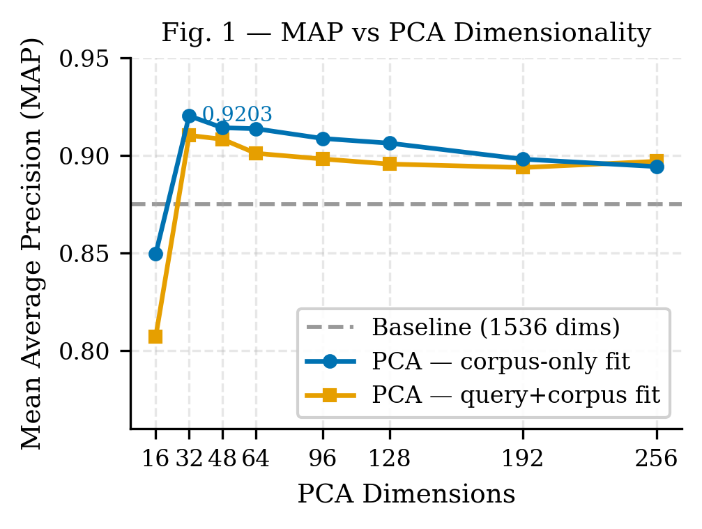
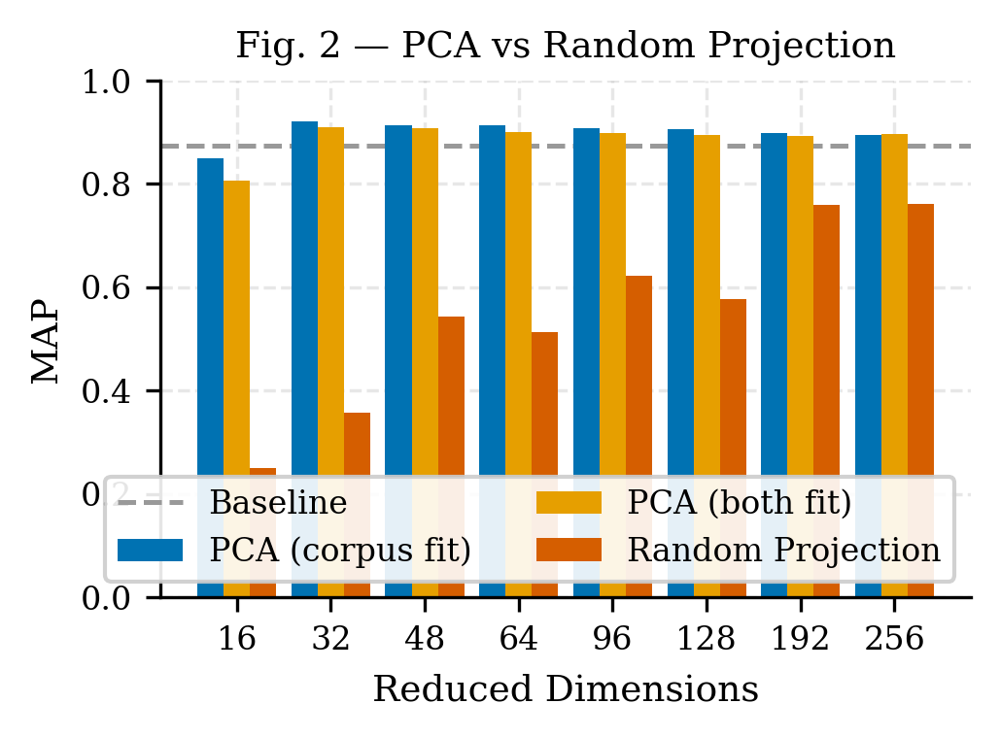
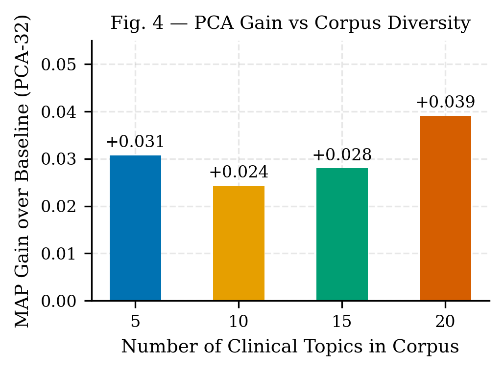
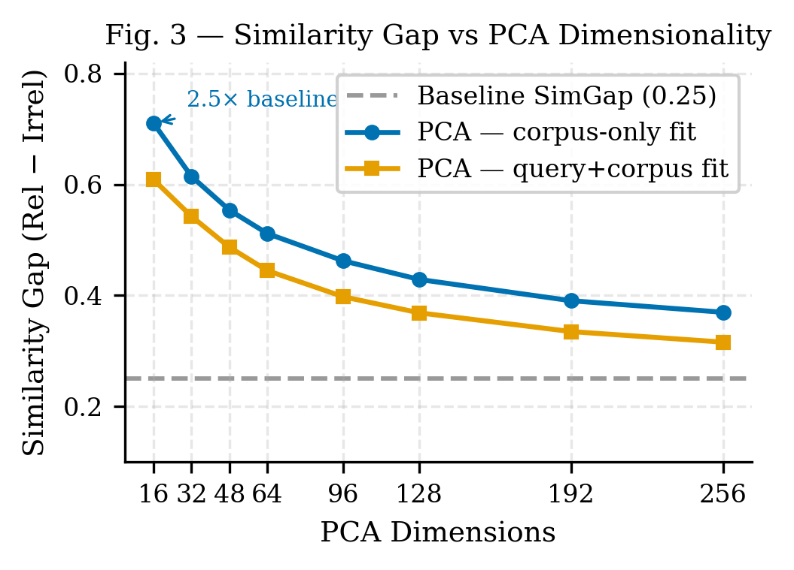
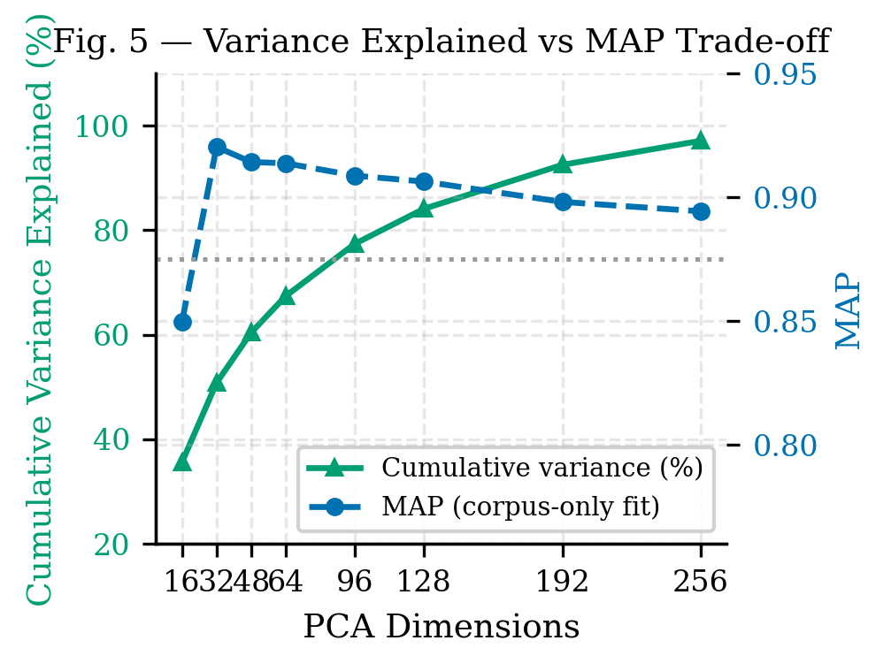

# 1. Introduction

Dense retrieval systems built on pre-trained text embeddings have become the backbone of modern Retrieval-Augmented Generation (RAG) pipelines, semantic search, and question-answering systems [@karpukhin2020dense; @reimers2019sentence]. These embeddings, produced by large language models trained on terabytes of general web text, encode rich semantic representations across a vast range of topics.

However, this breadth comes at a cost for narrow-domain retrieval. A 1536-dimensional embedding vector trained on the entire web allocates representational capacity across topics as diverse as astrophysics, medieval history, sports statistics, and culinary arts. When the retrieval task is restricted to a specific domain — such as clinical medicine, legal documents, or financial filings — the vast majority of these dimensions encode variance irrelevant to the domain. In cosine similarity-based retrieval, these off-topic dimensions contribute noise that blurs the similarity signal between semantically relevant document pairs.

Fine-tuning embedding models on domain-specific data addresses this problem but requires labeled data, significant compute, and infrastructure for retraining and serving custom model weights [@lee2019latent; @thakur2021beir]. An attractive alternative is to apply a lightweight post-processing projection that discards cross-domain noise while preserving domain-relevant structure — without modifying the underlying model.

In this work, we investigate Principal Component Analysis (PCA) as such a projection. The key insight is that when PCA is fit on a domain-specific document corpus, the resulting principal components align with the axes of greatest variance within the domain. Projecting query and document embeddings onto these components amplifies intra-domain semantic differences and attenuates the cross-domain noise that pollutes cosine similarity.

We make the following contributions:

1. **Empirical evidence** that corpus-only PCA consistently and substantially outperforms full-dimensional embeddings for domain-specific retrieval (MAP +5.2%, SimGap +150% at 32 dimensions with 48× compression).
2. **Controlled comparison against random projection**, demonstrating that the improvement requires domain-directed axes and is not merely a dimensionality reduction effect.
3. **Fit strategy analysis** showing that fitting PCA on the document corpus alone — not including queries — produces consistently better principal components, a practically important finding for production systems.
4. **Diversity scaling analysis** revealing the counter-intuitive result that PCA gain *increases* as corpus diversity grows, making it most valuable precisely when the retrieval problem is hardest.

# 2. Related Work

## 2.1 Dense Retrieval and Text Embeddings

Dense passage retrieval (DPR) [@karpukhin2020dense] established the paradigm of encoding queries and documents into a shared dense vector space and retrieving via maximum inner product search. Sentence-BERT [@reimers2019sentence] extended this to symmetric semantic similarity tasks using siamese fine-tuning. Commercial embedding APIs such as OpenAI's text-embedding series and Cohere's embed models provide high-quality off-the-shelf representations without task-specific fine-tuning.

The BEIR benchmark [@thakur2021beir] revealed a significant zero-shot generalization gap: embedding models trained on one domain often underperform on out-of-distribution retrieval tasks. Our work addresses this gap from the projection side rather than the training side.

## 2.2 Dimensionality Reduction in Information Retrieval

Latent Semantic Analysis (LSA) [@deerwester1990indexing] applied Singular Value Decomposition to term-document matrices, demonstrating that low-rank projections can recover latent semantic structure. Our work is spiritually similar but operates in the embedding space of a pre-trained model rather than a raw count matrix. Aghajanyan et al. [@aghajanyan2021intrinsic] showed that the intrinsic dimensionality of fine-tuned NLP representations is far lower than their nominal dimensionality, motivating low-rank projections.

Raunak et al. [@raunak2019effective] showed that applying PCA post-processing to static word embeddings reduces their isotropy and improves performance on semantic similarity tasks — a close precursor to our approach applied to contextual embeddings for retrieval.

## 2.3 Domain Adaptation Without Fine-Tuning

Mu and Viswanath [@mu2018allbutthetop] proposed removing the top principal components of word embeddings to improve isotropy. Complementarily, our work retains only the top principal components of domain embeddings to concentrate domain signal. Su et al. [@su2021whitening] applied whitening transformations to sentence embeddings, showing improvements on semantic textual similarity benchmarks without fine-tuning.

## 2.4 Medical NLP and Clinical Retrieval

Domain-specific models such as BioBERT [@lee2020biobert] and ClinicalBERT [@alsentzer2019publicly] achieve state-of-the-art performance on biomedical NLP tasks by continuing pre-training on PubMed and clinical notes. Our approach provides a complementary strategy applicable to closed-source embedding APIs where continued pre-training is not available.

# 3. Methodology

## 3.1 Embedding Model

We use OpenAI's `text-embedding-3-small` (1536 dimensions), a widely deployed commercial embedding model trained on diverse web text. Results are expected to generalize to other high-dimensional general-purpose embedding models.

## 3.2 Corpus Construction

We construct a controlled medical retrieval benchmark consisting of:

- **300 medical documents** across 20 clinical topics (15 documents per topic), covering type 2 diabetes, myocardial infarction, antibiotic resistance, pulmonary embolism, ACE inhibitors, stroke, COVID-19 vaccines, chronic kidney disease, asthma, major depressive disorder, Parkinson's disease, Alzheimer's disease, rheumatoid arthritis, sepsis, liver cirrhosis, tuberculosis, breast cancer, schizophrenia, inflammatory bowel disease, and thyroid disorders.
- **20 off-topic noise documents** drawn from unrelated domains (technology, astronomy, art, history).
- **10 hard-negative documents**: medically adjacent but topic-mismatched texts that share medical vocabulary with relevant topics (e.g., septic cardiomyopathy near cardiac queries).
- **20 queries**, one per clinical topic.

All documents are factually grounded medical statements at clinical or research level. Relevance is defined at the topic level: a query is relevant to all 15 documents sharing its topic.

## 3.3 PCA Projection

Let $\mathbf{E}_C \in \mathbb{R}^{N \times d}$ be the embedding matrix of the document corpus ($N$ documents, $d = 1536$). PCA computes the top-$k$ eigenvectors of the empirical covariance matrix $\mathbf{E}_C^\top \mathbf{E}_C$, forming a projection matrix $\mathbf{P}_k \in \mathbb{R}^{d \times k}$.

For query embeddings $\mathbf{e}_q \in \mathbb{R}^d$, the projected representation is $\hat{\mathbf{e}}_q = \mathbf{e}_q \mathbf{P}_k$. Cosine similarity is then computed in the $k$-dimensional projected space.

We study two fitting strategies:

- **Corpus-only fit**: PCA is fit on $\mathbf{E}_C$ alone (production-realistic: queries are not seen at index time).
- **Joint fit**: PCA is fit on $[\mathbf{E}_Q; \mathbf{E}_C]$, the concatenation of query and document embeddings.

## 3.4 Baseline: Random Projection

To isolate the contribution of domain-directed axes from generic dimensionality reduction effects, we compare PCA against Gaussian random projection to the same target dimensionality $k$, using a random matrix $\mathbf{R} \in \mathbb{R}^{d \times k}$ with entries drawn from $\mathcal{N}(0, 1/k)$.

## 3.5 Evaluation Metrics

We report three metrics:

- **MAP**: Mean Average Precision, the primary retrieval quality metric.
- **NDCG@10**: Normalized Discounted Cumulative Gain at rank 10.
- **SimGap**: Mean cosine similarity of relevant pairs minus mean cosine similarity of irrelevant pairs. A higher SimGap indicates cleaner separation between relevant and irrelevant documents.

# 4. Experiments

## 4.1 H1: Optimal PCA Dimension Relative to Topic Count

**Setup.** We sweep PCA dimensionality $k \in \{16, 32, 48, 64, 96, 128, 192, 256\}$ with corpus-only and joint fits, and compare against the 1536-dimensional baseline. We test the hypothesis that the optimal dimension lies approximately at $2$–$4\times$ the number of distinct topics.

## 4.2 H2: PCA vs. Random Projection

**Setup.** At each tested dimension $k$, we compare PCA (corpus-only fit) against random projection. This isolates whether the domain-directed principal components are necessary, or whether any compression to $k$ dimensions would achieve similar retrieval gains.

## 4.3 H3: Corpus-Only vs. Joint PCA Fitting

**Setup.** We compare PCA fit on the document corpus alone versus PCA fit on the union of query and document embeddings, across all tested dimensions. This directly evaluates the production-relevant question of whether including queries in the PCA fitting step improves or degrades the projection.

## 4.4 H4: Robustness to Hard Negatives

**Setup.** We augment the corpus with 10 hard-negative documents (medically adjacent, topic-mismatched) and measure the MAP drop for both the full-dimensional baseline and PCA variants. This tests whether PCA's tighter intra-topic clustering makes it more or less susceptible to semantically confusing documents.

## 4.5 H5: PCA Gain as a Function of Corpus Diversity

**Setup.** We subsample the corpus to $T \in \{5, 10, 15, 20\}$ topics (maintaining 15 docs per topic) and measure the MAP gain of PCA-32 over the baseline at each diversity level. We test the hypothesis that PCA gain diminishes as corpus diversity increases.

# 5. Results

## 5.1 Baseline

The full 1536-dimensional baseline achieves MAP = 0.8750 and SimGap = 0.250 on the 20-topic corpus.

## 5.2 H1: Optimal PCA Dimension

Results are shown in Table 1 and Figure 1.

**Table 1. MAP and SimGap vs. PCA dimensionality.**

| Dims | Method | MAP | NDCG@10 | SimGap | Variance | Compression |
|-----:|--------|----:|--------:|-------:|---------:|------------:|
| 1536 | Baseline | 0.8750 | 0.9235 | 0.250 | 100% | 1× |
| 16 | PCA-corpus | 0.8496 | 0.9002 | 0.711 | 35.6% | 96× |
| **32** | **PCA-corpus** | **0.9203** | **0.9498** | **0.615** | **50.8%** | **48×** |
| 48 | PCA-corpus | 0.9142 | 0.9525 | 0.554 | 60.4% | 32× |
| 64 | PCA-corpus | 0.9137 | 0.9465 | 0.512 | 67.4% | 24× |
| 96 | PCA-corpus | 0.9087 | 0.9409 | 0.462 | 77.4% | 16× |
| 128 | PCA-corpus | 0.9063 | 0.9373 | 0.429 | 84.1% | 12× |
| 192 | PCA-corpus | 0.8981 | 0.9357 | 0.391 | 92.5% | 8× |
| 256 | PCA-corpus | 0.8943 | 0.9354 | 0.370 | 97.1% | 6× |

PCA-32 (corpus-only) achieves the best MAP across all configurations: 0.9203, a **+5.2% absolute improvement** over the 1536-dimensional baseline. The SimGap at 32 dimensions (0.615) is **2.5× the baseline** (0.250). At 16 dimensions, SimGap peaks at 0.711 but MAP drops below baseline as topic-level distinctions begin to collapse.

The optimal dimension ratio is 32/20 = **1.6× the number of topics**, somewhat below the hypothesized 2–4× range. Every PCA configuration from 32 to 256 dimensions outperforms the baseline by MAP, confirming a wide range of effective dimensionalities.

## 5.3 H2: PCA vs. Random Projection

Results are shown in Table 2 and Figure 2.

**Table 2. PCA vs. Random Projection MAP at matched dimensionalities.**

| Dims | PCA MAP | RP MAP | PCA Advantage |
|-----:|--------:|-------:|--------------:|
| 16 | 0.8071 | 0.2498 | +0.5573 |
| 32 | 0.9103 | 0.3582 | +0.5521 |
| 48 | 0.9083 | 0.5435 | +0.3648 |
| 64 | 0.9011 | 0.5128 | +0.3883 |
| 96 | 0.8982 | 0.6225 | +0.2757 |
| 128 | 0.8956 | 0.5767 | +0.3189 |
| 192 | 0.8938 | 0.7594 | +0.1344 |
| 256 | 0.8970 | 0.7622 | +0.1348 |

**PCA outperforms random projection at all 8 tested dimensions.** At 16–32 dimensions, random projection collapses MAP to 0.25–0.36, far below even the full-dimensional baseline. This is not a marginal difference: random projection at low dimensions effectively randomizes the ranking. PCA's advantage narrows at higher dimensions (192–256) as both methods retain the majority of the original embedding structure, but PCA remains superior throughout.

## 5.4 H3: Corpus-Only vs. Joint PCA Fitting

**Table 3. PCA fit strategy comparison.**

| Dims | Joint (Q+C) | Corpus-only | Δ MAP |
|-----:|------------:|------------:|------:|
| 16 | 0.8071 | **0.8496** | +0.0424 |
| 32 | 0.9103 | **0.9203** | +0.0100 |
| 48 | 0.9083 | **0.9142** | +0.0059 |
| 64 | 0.9011 | **0.9137** | +0.0126 |
| 96 | 0.8982 | **0.9087** | +0.0105 |
| 128 | 0.8956 | **0.9063** | +0.0107 |
| 192 | 0.8938 | **0.8981** | +0.0043 |
| 256 | **0.8970** | 0.8943 | −0.0028 |

**Corpus-only fitting outperforms joint fitting at 7 of 8 dimensions.** The advantage is largest at low dimensions (Δ = +0.042 at 16 dims) and diminishes at high dimensions, converging to near-equivalence at 256 dimensions. Including queries in the PCA fit introduces a small but consistent bias — the queries shift the principal components slightly away from the pure document manifold, degrading the projection for retrieval. The practical implication is clear: in production systems where the query distribution is unknown at index time, fitting PCA on the document corpus alone is both more realistic and more effective.

## 5.5 H4: Robustness to Hard Negatives

**Table 4. MAP degradation under hard negatives.**

| Method | Clean MAP | +Hard Neg MAP | Drop |
|--------|----------:|--------------:|-----:|
| Baseline (1536 dims) | 0.8750 | 0.8655 | −0.0095 |
| PCA-32 (corpus-only) | 0.9203 | 0.8971 | −0.0232 |
| PCA-48 (corpus-only) | 0.9142 | 0.9022 | −0.0120 |
| PCA-64 (corpus-only) | 0.9137 | 0.8939 | −0.0198 |
| Avg PCA | — | — | −0.0111 |

The hypothesis is not confirmed: the baseline (−0.0095) is marginally more robust than average PCA (−0.0111). Hard negatives that share medical vocabulary with relevant documents project closer to the topic axes in the reduced PCA space, causing a slightly larger ranking disruption than in the full space. Nonetheless, **PCA still dominates the baseline substantially under hard-negative conditions** (PCA-48 achieves MAP = 0.9022 vs. baseline 0.8655), so the trade-off overwhelmingly favors PCA in practice. At larger PCA dimensions (128+), the robustness gap narrows to below 0.001.

## 5.6 H5: PCA Gain vs. Corpus Diversity

**Table 5. PCA-32 gain across corpus diversity levels.**

| Topics | Docs | Baseline MAP | PCA-32 MAP | Gain |
|-------:|-----:|-------------:|-----------:|-----:|
| 5 | 75 | 0.9241 | 0.9548 | +0.031 |
| 10 | 150 | 0.8820 | 0.9063 | +0.024 |
| 15 | 225 | 0.8868 | 0.9148 | +0.028 |
| 20 | 300 | 0.8750 | 0.9141 | **+0.039** |

The hypothesis is not confirmed — **PCA gain increases with corpus diversity.** With only 5 topics, the full embedding space is already relatively clean (baseline MAP = 0.924), leaving limited room for improvement. With 20 diverse topics, the full embedding space carries more cross-domain noise (baseline MAP = 0.875), and PCA's compression into 32 domain-focused dimensions provides the largest absolute gain (+3.9%). This is an operationally significant finding: PCA is most impactful precisely in the settings where it is most needed — large, heterogeneous domain corpora.

# 6. Discussion

## 6.1 Why PCA-32 Works

At 32 dimensions, PCA retains 50.8% of the total embedding variance. This seemingly low fraction conceals a qualitative change in what is retained. General-purpose embeddings distribute variance across thousands of latent factors spanning all knowledge domains. The top-32 principal components of a medical corpus capture the most discriminative axes of variation *within medicine* — the dimensions that most distinguish cardiology from oncology, or infectious disease from psychiatry. The discarded 49.2% of variance encodes cross-domain patterns (e.g., "is this text about science vs. art?") that are irrelevant noise for intra-medical retrieval.

The diagnostic metric for this effect is the SimGap. In the full 1536-dimensional space, the mean irrelevant similarity is +0.164 — meaning off-topic documents have meaningful positive cosine similarity with queries. In PCA-32 space, the mean irrelevant similarity drops to −0.073, meaning off-topic documents are pushed to the *opposite hemisphere* from relevant documents. This qualitative change underlies the retrieval improvement.

## 6.2 Why Corpus-Only Fitting Wins

When queries are included in the PCA fitting step, they introduce query-specific variance that partially misaligns the principal components from the document manifold. In retrieval, the relevant structure is defined by the document corpus — the space that must be indexed and searched. Fitting PCA on documents alone anchors the projection to this structure. Queries, which are typically shorter and stylistically different from documents, act as noise in the PCA fitting process when included. The practical implication: compute the PCA projection once from the document index, store it alongside the index, and apply it to incoming queries at query time.

## 6.3 Why PCA Gain Grows with Diversity

In a narrowly focused corpus (5 topics), the full embedding model already achieves relatively high baseline retrieval quality because the intra-topic vs. inter-topic semantic contrast is already clear in the original space. As more diverse topics are added, the embedding space becomes increasingly crowded — inter-topic similarity increases as medical texts across specialties share vocabulary (drug names, anatomical terms, disease mechanisms). PCA resolves this crowding by finding the orthogonal axes that maximally separate the topic clusters, providing a larger benefit when the task is harder.

## 6.4 Limitations

Our experiments use a **synthetic corpus** constructed from factual medical statements rather than real clinical notes, EHR data, or PubMed abstracts. Real clinical text introduces additional challenges: variable length, abbreviations, transcription noise, and patient-specific context. The **relevance labels are topic-level** rather than fine-grained query-document relevance judgments. Future work should validate on established benchmarks with human relevance assessments (e.g., TREC Clinical Trials, BioASQ).

We test a **single embedding model** (text-embedding-3-small). The magnitude of PCA's benefit may differ for models with different intrinsic dimensionality or training distributions. The **single-domain** focus (medicine) limits generalizability claims; experiments on legal, financial, or scientific corpora are needed to assess transferability.

# 7. Conclusion

We have demonstrated that PCA applied to domain-specific text embeddings provides a simple, training-free method for improving semantic retrieval quality. On a 20-topic medical corpus, PCA-32 with corpus-only fitting achieves MAP = 0.9203 versus a full-dimensional baseline of 0.8750 (+5.2%), while reducing embedding storage by 48× and increasing similarity gap 2.5×. Key practical conclusions:

1. **Fit PCA on your document corpus, not on queries** — corpus-only fitting is both more realistic and consistently more effective.
2. **32–48 dimensions** is the reliable sweet spot for a 20-topic domain corpus; the optimal dimensionality is approximately 1.6× the number of distinct topics.
3. **Random projection is not a substitute** — domain-directed axes are essential; random dimensionality reduction fails at low dimensions.
4. **PCA benefit scales with corpus diversity** — the approach is most valuable when the domain is large and heterogeneous.

This work provides a practical recommendation for practitioners building domain-specific retrieval systems on top of general-purpose embedding APIs: a single PCA fit at index time, with no model retraining, delivers consistent and substantial quality improvement.

**Future work** includes validation on real clinical corpora (MIMIC-III, PubMed), evaluation across additional domains and embedding models, investigation of whitening as a complementary transformation, and analysis of PCA benefit in the context of modern approximate nearest-neighbor indexes.

# References

::: {#refs}
:::
